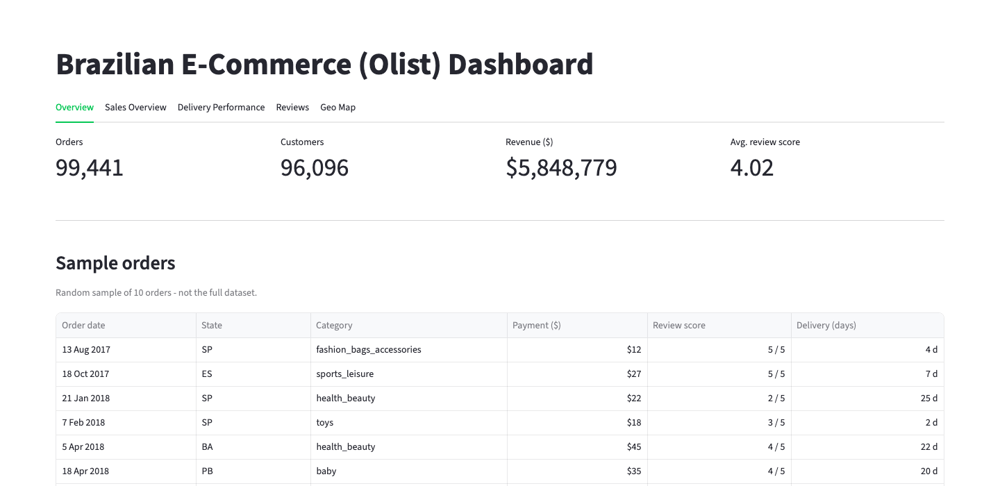
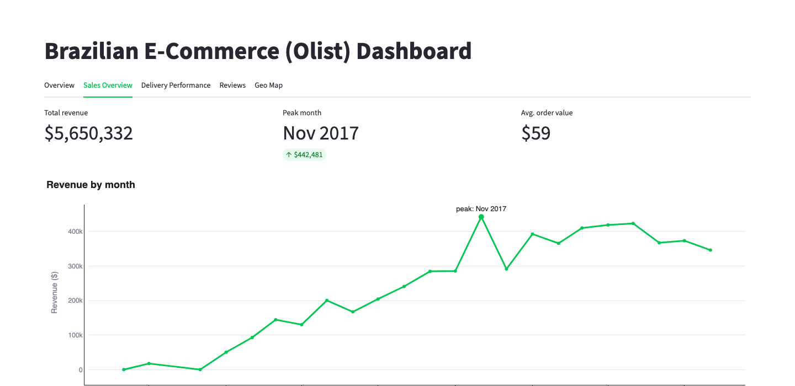
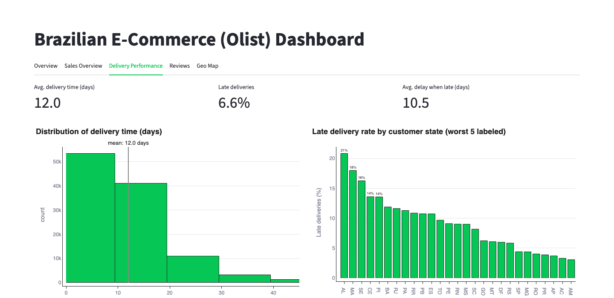

# Olist Brazilian E-Commerce Dashboard

[](https://brazilian-e-commerce-f4g54pnlecrcpe78uuhovp.streamlit.app/)


An interactive Streamlit dashboard built on the Olist public dataset (~99k real orders placed on a
Brazilian marketplace between 2016-2018). The dashboard joins nine relational CSV files — orders,
order items, payments, reviews, customers, sellers, products, geolocation, and a category-name
translation table — into one denormalized order-level table, then surfaces it as a single-page app
with five tabs: overview, sales performance, delivery performance, review analysis, and a
geographic revenue map. Deployed on Streamlit Community Cloud.

## Preview

---

| Overview | Sales Overview | Delivery Performance |
|:---:|:---:|:---:|
|  |  |  |

## Project Structure

```
Brazilian E-Commerce/
├── app.py                                          # Entry point: Overview + Sales/Delivery/Reviews/Geo Map tabs
├── src/
│   ├── data_loader.py                              # Cached loaders for each CSV + the joined order-level table
│   ├── currency.py                                 # Fixed BRL→USD display conversion
│   └── theme.py                                    # Brand color palette + shared Plotly chart styling
├── data/                                           # Raw Olist CSVs (see Dataset section)
├── docs/                                           # Reusable Streamlit theming notes
├── .streamlit/config.toml                          # Theme
├── requirements.txt                                # Python dependencies, version-pinned
└── README.md                                       # This file
```

| File / Folder | Purpose |
|---|---|
| `app.py` | Streamlit entry point — loads the data once, then renders all 5 tabs (Overview, Sales Overview, Delivery Performance, Reviews, Geo Map) |
| `src/data_loader.py` | All CSV loading and joining logic, `@st.cache_data`-wrapped so repeated reruns don't re-read disk |
| `src/currency.py` | Fixed BRL→USD display conversion used by every tab that shows a money value |
| `src/theme.py` | Brand color constants and the shared `style_fig()` helper every Plotly chart is passed through |
| `data/*.csv` | Raw source data — consumed only by `src/data_loader.py`, never read directly from `app.py` |
| `requirements.txt` | Python packages required, pinned to the exact tested versions |
| `README.md` | This file |

## Dataset

- **Source:** Olist Store public e-commerce dataset (Brazilian marketplace, orders 2016-2018).
- **Size / scope:** 9 CSV files joined via `order_id` / `customer_id` / `product_id` / `seller_id` /
  zip-code prefix.

| File | Rows |
|---|---|
| `olist_orders_dataset.csv` | 99,441 |
| `olist_customers_dataset.csv` | 99,441 |
| `olist_order_items_dataset.csv` | 112,650 |
| `olist_order_payments_dataset.csv` | 103,886 |
| `olist_order_reviews_dataset.csv` | 99,224 |
| `olist_products_dataset.csv` | 32,951 |
| `olist_sellers_dataset.csv` | 3,095 |
| `olist_geolocation_dataset.csv` | 1,000,163 (→ 19,015 unique zip prefixes after aggregation) |
| `product_category_name_translation.csv` | 70 |

Note: a raw `wc -l` line count on `olist_order_reviews_dataset.csv` gives ~104,719 — that's wrong.
`review_comment_message` is free text with embedded newlines inside quoted CSV fields, so line
count overcounts rows. The 99,224 figure above is the correct one, confirmed by loading the file
with pandas.

## Environment Setup

```bash
python3 -m venv .venv
source .venv/bin/activate
pip install -r requirements.txt
```

```bash
streamlit run app.py
```

## Methodology

The work follows a standard data-science lifecycle (CRISP-DM-style), adapted for a descriptive
analytics dashboard rather than a predictive model: understand the goal, understand the raw data,
prepare it, build the analysis surface, evaluate that it actually works, then ship it. Each phase
depends on the previous one being verified, not just written.

### Phase 1: Business Understanding *(done)*
Define what the dashboard needs to answer: how sales, delivery performance, and customer
satisfaction behave across Olist's marketplace, packaged as a Streamlit app deployable to
Streamlit Community Cloud.

**Findings / Result:**
- Scoped to 4 questions — sales, delivery performance, reviews, geography — each mapped 1:1 to a tab.

### Phase 2: Data Understanding *(done)*
Inventory the 9 raw CSVs, their join keys, row counts, and schema (see Dataset section above), and
surface data issues before building anything on top of them.

**Findings / Result:**
- Join keys confirmed across all 9 files: `order_id`, `customer_id`, `product_id`, `seller_id`, zip prefix.
- Geolocation is noisy: 1,000,163 raw lat/lng rows for only 19,015 unique zip prefixes.
- `review_comment_title`/`review_comment_message` are frequently null (optional free text).
- `wc -l` overcounts the reviews file (~104,719 vs. true 99,224) — embedded newlines in quoted fields.

### Phase 3: Data Preparation *(done)*
`src/data_loader.py` loads each CSV, parses date columns, resolves the two issues found in Phase
2, and joins orders + customers + items + products + payments + reviews into one order-level table
(`load_orders_full`), deriving `delivery_days`, `delay_days`, and `is_late`.

**Findings / Result:**
- Geolocation deduped to one row per zip prefix (median lat/lng) so the geo join doesn't fan out.
- Joined table: 113,425 rows × 33 columns (> 99,441 orders since one order can have multiple items).
- `delivery_days` null for ~2.8% of rows (undelivered/cancelled orders) — excluded, not zeroed.
- Bug found and fixed: the date-parser missed `_timestamp`-suffixed columns, silently leaving
  `order_purchase_timestamp` as a string and breaking every delivery/delay calc downstream.

### Phase 4: Analysis & Dashboard Development *(done)*
Build the four analysis surfaces against the joined table — Sales Overview, Delivery Performance,
Reviews, and a Geo Map — in place of a predictive model, since the goal here is descriptive
analytics, not forecasting.

**Findings / Result:**
- All 4 surfaces implemented, each answering one Phase 1 question against `load_orders_full`.
- Bug found and fixed: `plotly==7.0.0` dropped `px.scatter_mapbox` — Geo Map switched to `px.scatter_map`.
- Added USD display (`src/currency.py`) at a **fixed** ~3.5 BRL/USD rate (2016-18 average) — a
  display simplification, not day-to-day FX accuracy.

### Phase 5: Evaluation *(done)*
Verify the app actually runs, not just that the code looks right, and audit every column of the
joined table for nulls/outliers introduced by the joins themselves.

**Findings / Result:**
- Verified end-to-end with no uncaught exceptions (`AppTest`, then a headless browser after the
  later tabs consolidation — see addendum below).
- Bug found and fixed: `use_container_width=True` is deprecated — replaced with `width="stretch"`
  throughout.
- Full null audit (113,425 rows), all traced to expected causes: undelivered/cancelled orders
  (`delivery_days`, 2.85%), orders with no `order_items` row (`price`/`freight_value`, 0.68%),
  unreviewed orders (`review_score`, 0.85%), and 610 products with no category in the raw data.
- Bug found and fixed: 2 category names had no row in the translation table, so `groupby` silently
  dropped their revenue from every category chart — fixed with a fallback to the Portuguese name.
- Sanity checks passed: no bad prices/freight, scores always in `[1, 5]`, no duplicate order/item pairs.

### Phase 6: Deployment *(done)*
Pushed the repo to GitHub and connected it to Streamlit Community Cloud. `data/*.csv` ships
committed in the repo — every file is under GitHub's 100 MB limit, so no external storage was
needed.

## Phase 4 addendum: visualization redesign

The first pass of all four dashboard pages rendered but read as flat - correct
numbers, no story. Redesigned every chart against a systematic color/form method
(job-driven color: categorical vs. sequential vs. diverging; direct labels;
render-and-look QA) rather than default Plotly styling.

**Findings / Result:**
- Rendering each chart and actually looking at it caught 2 bugs `AppTest` couldn't
  (it only checks "did the script raise"): the Geo Map was silently centered on
  Africa (`zoom` with no `center` defaults to 0°,0° — fixed with an explicit Brazil
  center), and 3 mis-geocoded zip prefixes forced the map to zoom out to fit a
  stray point in Portugal (filtered to Brazil's real bounding box).
- Geo Map switched from `color="state"` (27 indistinguishable hues) to
  `color="revenue"` on a sequential ramp, capped at the 95th percentile since
  revenue-per-zip is heavily right-skewed.
- Delivery delay vs. review score is now a diverging bar (brand = early, red =
  late) — surfaced a real finding: the early-arrival gap widens from -5.9d
  (1-star) to -13.4d (5-star).
- Review charts use a fixed ordinal color scale (originally red-gray-blue,
  later a monotone brand ramp — see UI consolidation addendum).
- Fixed label clipping on both horizontal bar charts and a 0-5 axis on the
  lowest-rated-categories chart that made all 15 bars look the same length.
- Added selective value labels and headline stat tiles so each tab leads with
  a number, not just a chart.

## Phase 6 addendum: UI consolidation

After the initial 4-page multipage build shipped, the app was reworked into a single page with
`st.tabs()` (Overview, Sales Overview, Delivery Performance, Reviews, Geo Map) instead of
Streamlit's sidebar-based multipage navigation, rebranded to a green theme, and simplified: the
R$/USD toggle became a fixed USD-only display, and every chart now runs through one shared
`style_fig()` helper (`src/theme.py`) for consistent bold labels, outlined bars, and minimal
gridlines.

**Findings / Result:**
- Merging 4 pages into one tabbed script added no real cost — all data loaders were already cached.
- Bug found and fixed: unconditional chart-title styling made Plotly print the literal string
  `"undefined"` over the (title-less) Geo Map — `style_fig()` now only styles titles that exist.
- Overview's raw table preview replaced with a curated 10-row sample (readable columns, formatted
  currency/dates via `st.column_config`).
- Verified all 5 tabs in headless Chromium (Playwright): no exceptions, no console errors.

## Status

- [x] Phase 1 — Business Understanding (4 analysis questions scoped)
- [x] Phase 2 — Data Understanding (9 files inventoried, 2 data issues found)
- [x] Phase 3 — Data Preparation (joined table built, 1 bug found and fixed)
- [x] Phase 4 — Analysis & Dashboard Development (4 analysis surfaces built, 1 bug found and fixed)
- [x] Phase 5 — Evaluation (app verified end-to-end; full null audit done, 1 more bug found
  and fixed: missing category translations silently dropping revenue from charts)
- [x] Phase 6 — Deployment (pushed to GitHub, live on Streamlit Community Cloud)

`app.py` runs end-to-end with no exceptions, verified in a real browser (headless Chromium) across
all 5 tabs. Deployed.
