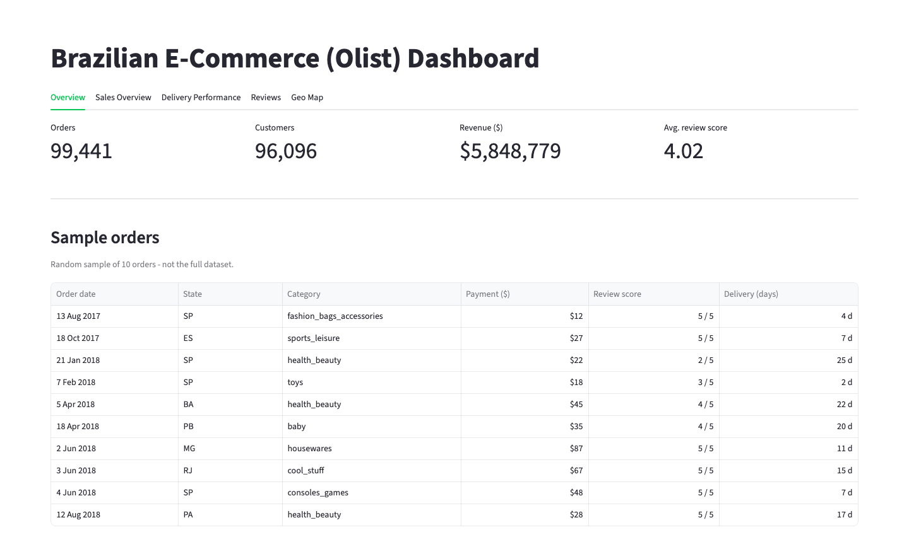

# Olist Brazilian E-Commerce Dashboard


**Live demo:** [brazilian-e-commerce-f4g54pnlecrcpe78uuhovp.streamlit.app](https://brazilian-e-commerce-f4g54pnlecrcpe78uuhovp.streamlit.app/)



An interactive Streamlit dashboard built on the Olist public dataset (~99k real orders placed on a
Brazilian marketplace between 2016-2018). The dashboard joins nine relational CSV files — orders,
order items, payments, reviews, customers, sellers, products, geolocation, and a category-name
translation table — into one denormalized order-level table, then surfaces it as a single-page app
with five tabs: overview, sales performance, delivery performance, review analysis, and a
geographic revenue map. Deployed on Streamlit Community Cloud.

## Project Structure

```
Brazilian E-Commerce/
├── app.py                                          # Entry point: Overview + Sales/Delivery/Reviews/Geo Map tabs
├── src/
│   ├── data_loader.py                              # Cached loaders for each CSV + the joined order-level table
│   ├── currency.py                                 # Fixed BRL→USD display conversion
│   └── theme.py                                    # Brand color palette + shared Plotly chart styling
├── data/                                           # Raw Olist CSVs (see Dataset section)
├── docs/                                           # Reusable Streamlit theming notes
├── .streamlit/config.toml                          # Theme
├── requirements.txt                                # Python dependencies, version-pinned
└── README.md                                       # This file
```

| File / Folder | Purpose |
|---|---|
| `app.py` | Streamlit entry point — loads the data once, then renders all 5 tabs (Overview, Sales Overview, Delivery Performance, Reviews, Geo Map) |
| `src/data_loader.py` | All CSV loading and joining logic, `@st.cache_data`-wrapped so repeated reruns don't re-read disk |
| `src/currency.py` | Fixed BRL→USD display conversion used by every tab that shows a money value |
| `src/theme.py` | Brand color constants and the shared `style_fig()` helper every Plotly chart is passed through |
| `data/*.csv` | Raw source data — consumed only by `src/data_loader.py`, never read directly from `app.py` |
| `requirements.txt` | Python packages required, pinned to the exact tested versions |
| `README.md` | This file |

## Dataset

- **Source:** Olist Store public e-commerce dataset (Brazilian marketplace, orders 2016-2018).
- **Size / scope:** 9 CSV files joined via `order_id` / `customer_id` / `product_id` / `seller_id` /
  zip-code prefix.

| File | Rows |
|---|---|
| `olist_orders_dataset.csv` | 99,441 |
| `olist_customers_dataset.csv` | 99,441 |
| `olist_order_items_dataset.csv` | 112,650 |
| `olist_order_payments_dataset.csv` | 103,886 |
| `olist_order_reviews_dataset.csv` | 99,224 |
| `olist_products_dataset.csv` | 32,951 |
| `olist_sellers_dataset.csv` | 3,095 |
| `olist_geolocation_dataset.csv` | 1,000,163 (→ 19,015 unique zip prefixes after aggregation) |
| `product_category_name_translation.csv` | 70 |

Note: a raw `wc -l` line count on `olist_order_reviews_dataset.csv` gives ~104,719 — that's wrong.
`review_comment_message` is free text with embedded newlines inside quoted CSV fields, so line
count overcounts rows. The 99,224 figure above is the correct one, confirmed by loading the file
with pandas.

## Environment Setup

```bash
python3 -m venv .venv
source .venv/bin/activate
pip install -r requirements.txt
```

```bash
streamlit run app.py
```

## Methodology

The work follows a standard data-science lifecycle (CRISP-DM-style), adapted for a descriptive
analytics dashboard rather than a predictive model: understand the goal, understand the raw data,
prepare it, build the analysis surface, evaluate that it actually works, then ship it. Each phase
depends on the previous one being verified, not just written.

### Phase 1: Business Understanding *(done)*
Define what the dashboard needs to answer: how sales, delivery performance, and customer
satisfaction behave across Olist's marketplace, packaged as a Streamlit app deployable to
Streamlit Community Cloud.

**Findings / Result:**
- Scoped to 4 analysis surfaces: sales, delivery performance, reviews, geography — matched to the
  4 dashboard pages, so every page maps back to a stated question rather than existing for its own
  sake.

### Phase 2: Data Understanding *(done)*
Inventory the 9 raw CSVs, their join keys, row counts, and schema (see Dataset section above), and
surface data issues before building anything on top of them.

**Findings / Result:**
- Confirmed join keys across all 9 files: `order_id`, `customer_id`, `product_id`, `seller_id`,
  and zip-code prefix.
- **Geolocation has many lat/lng rows per zip-code prefix** (GPS noise — 1,000,163 raw rows for
  only 19,015 unique zip prefixes).
- **`review_comment_title` / `review_comment_message` are frequently null** (optional free-text
  field).
- A raw `wc -l` line count on the reviews file (~104,719) overcounts rows because
  `review_comment_message` contains embedded newlines inside quoted fields — true count is 99,224,
  confirmed by parsing with pandas.

### Phase 3: Data Preparation *(done)*
`src/data_loader.py` loads each CSV, parses date columns, resolves the two issues found in Phase
2, and joins orders + customers + items + products + payments + reviews into one order-level table
(`load_orders_full`), deriving `delivery_days`, `delay_days`, and `is_late`.

**Findings / Result:**
- Geolocation dedup: each zip prefix collapsed to its median lat/lng, so the geo join no longer
  fans out order/customer rows.
- Joined table: 113,425 rows × 33 columns (exceeds the 99,441 orders because one order can have
  multiple `order_items` rows).
- `delivery_days` is null for 3,229 of those rows (~2.8%) — orders not yet delivered or cancelled;
  excluded from delivery-time charts rather than treated as zero.
- Bug found and fixed: the date-column auto-detector only matched `_date`/`_at` suffixes, so
  `order_purchase_timestamp` (suffix `_timestamp`) was silently left as a string, breaking every
  `delivery_days`/`delay_days` calculation downstream. Fixed by adding `_timestamp` to the suffix
  check in `load_orders()`.

### Phase 4: Analysis & Dashboard Development *(done)*
Build the four analysis surfaces against the joined table — Sales Overview, Delivery Performance,
Reviews, and a Geo Map — in place of a predictive model, since the goal here is descriptive
analytics, not forecasting.

**Findings / Result:**
- All 4 surfaces implemented, each answering one Phase 1 question against `load_orders_full`.
- Bug found and fixed: `plotly==7.0.0` removed `px.scatter_mapbox` entirely (Mapbox-based traces
  were dropped); the Geo Map now uses its replacement, `px.scatter_map`.
- Added USD display conversion (`src/currency.py`) using one **fixed** approximate rate (3.5 BRL
  per USD — the rough average of 2016 (3.48), 2017 (3.19), and 2018 (3.67) per
  exchange-rates.org). This is a simplification: it does not reflect day-to-day FX movement, only
  a rough R$-to-$ scale for display. A historically accurate conversion would need a daily rate
  table joined by `order_purchase_timestamp` instead.

### Phase 5: Evaluation *(done)*
Verify the app actually runs, not just that the code looks right, and audit every column of the
joined table for nulls/outliers introduced by the joins themselves.

**Findings / Result:**
- `app.py` verified end-to-end with no uncaught exceptions (checked via `streamlit.testing.v1.AppTest`
  when it was still split across `app.py` + 4 pages, and again in a headless browser after the
  later single-page/tabs consolidation — see addendum below).
- Bug found and fixed: `use_container_width=True` is deprecated across all `st.dataframe` /
  `st.plotly_chart` calls; replaced with `width="stretch"` throughout.
- Full null audit across the 113,425-row joined table, cross-checked against `order_status`:
  - `delivery_days`/`delay_days` (2.85%) — almost entirely `shipped`/`canceled`/`unavailable`/
    `invoiced`/`processing` orders that never got delivered, as expected. Only 11 rows (8
    `delivered`, 3 `approved`) have a null delivery date despite the status — a known quirk in the
    raw Olist data, too small to affect any chart.
  - `product_id`/`price`/`freight_value` (0.68%, 775 rows) — orders with no matching
    `order_items` row at all (mostly `unavailable`/`canceled`). Correctly excluded from
    item/category-level charts by the join itself.
  - `review_score` (0.85%, 961 rows) — orders never reviewed (mostly still `delivered`, just no
    review submitted). `pandas.mean()`/`value_counts()` already ignore these correctly.
  - `product_category_name` (610 rows in the raw `olist_products_dataset.csv` itself) — a genuine
    gap in the source data with no category to recover.
- Bug found and fixed: 2 category names (`pc_gamer`,
  `portateis_cozinha_e_preparadores_de_alimentos`) exist in `olist_products_dataset.csv` but have
  no row in `product_category_name_translation.csv`. Because pandas `groupby` drops `NaN` keys,
  every category chart was silently dropping that revenue. Fixed in `load_products()` with a
  `fillna` fallback to the original Portuguese name.
- Sanity checks all passed: no `price <= 0`, no negative `freight_value`, `review_score` always in
  `[1, 5]`, zero duplicate `(order_id, order_item_id)` pairs — confirms the join layer isn't
  fanning out or corrupting rows.

### Phase 6: Deployment *(done)*
Pushed the repo to GitHub and connected it to Streamlit Community Cloud. `data/*.csv` ships
committed in the repo — every file is under GitHub's 100 MB limit, so no external storage was
needed.

## Phase 4 addendum: visualization redesign

The first pass of all four dashboard pages rendered but read as flat - correct
numbers, no story. Redesigned every chart against a systematic color/form method
(job-driven color: categorical vs. sequential vs. diverging; direct labels;
render-and-look QA) rather than default Plotly styling.

**Findings / Result:**
- Rendered every chart to a static image and actually looked at it (rather than
  trusting that green tests meant the chart was readable) - this caught 2 real bugs
  that `AppTest` could never catch, since it only checks "did the script raise":
  - **The Geo Map was silently centered on Africa.** `px.scatter_map(..., zoom=3)`
    with no explicit `center` defaults to (0°, 0°) - off the West African coast -
    not an auto-fit to the data. Fixed with an explicit `center` on Brazil.
  - **3 zip prefixes (4 orders) are mis-geocoded outside Brazil entirely** - one
    lands in Portugal (lat/lon ~41, -8.6). Left in, they forced the map to zoom
    out to fit a stray point on another continent. Filtered to Brazil's real
    bounding box before plotting.
- Replaced the Geo Map's `color="state"` (27 categorical hues on an all-pairs
  map form, which caps at 3 series before colors become indistinguishable) with
  `color="revenue"` on a single sequential ramp - matches the actual job
  (comparing magnitude, not telling 27 states apart) and reads correctly at any
  series count. Revenue-per-zip turned out heavily right-skewed (median R$649 vs.
  a R$109,760 max), so the color domain is capped at the 95th percentile -
  otherwise a handful of zips wash out the color scale for everyone else.
- Delivery delay vs. review score is now a **diverging** bar (brand color = early,
  red = late, centered on zero) instead of an uncolored bar - it's a delta-to-baseline
  job, and the real numbers turned out to be a genuine finding: every score
  arrives early on average, but the gap widens from -5.9 days (1-star) to -13.4
  days (5-star) - earlier delivery tracks with happier customers.
- Review score distribution and the lowest-rated-categories chart both use a
  fixed color map keyed to the 1-5 score (ordinal, not nominal - order carries
  meaning) so rank reads from color at a glance. (Originally a red-gray-blue
  good/bad scale; later switched to a monotone light-to-dark brand-color ramp
  to keep the Reviews tab in the same single color family as the rest of the
  app - see the UI consolidation addendum below.)
- Fixed 2 label-clipping / dead-space issues only visible by rendering: long
  category names were cut off on the left of both horizontal bar charts
  (`yaxis.automargin`), and the lowest-rated-categories chart spanned 0-5 when
  every value sits between 3.2-3.9 - all 15 bars looked the same length until
  the axis was zoomed to the data's actual range.
- Added direct value labels (selective - only the extremes or top-N, never every
  bar) and headline stat tiles (peak month, total revenue, avg. order value) so
  each page leads with a number, not just a chart.

## Phase 6 addendum: UI consolidation

After the initial 4-page multipage build shipped, the app was reworked into a single page with
`st.tabs()` (Overview, Sales Overview, Delivery Performance, Reviews, Geo Map) instead of
Streamlit's sidebar-based multipage navigation, rebranded to a green theme, and simplified: the
R$/USD toggle became a fixed USD-only display, and every chart now runs through one shared
`style_fig()` helper (`src/theme.py`) for consistent bold labels, outlined bars, and minimal
gridlines.

**Findings / Result:**
- All data loaders were already `@st.cache_data`-wrapped, so merging 4 pages' worth of chart code
  into one script (all tabs execute on every rerun — Streamlit doesn't lazily skip hidden tab
  content) added no noticeable load-time cost.
- Bug found and fixed: applying the shared chart-title styling unconditionally made Plotly's map
  renderer print the literal string `"undefined"` over the Geo Map, which has no chart title.
  `style_fig()` now only sets title styling when the figure actually has title text.
- The Overview tab's raw full-table preview was replaced with a curated 10-row random sample
  (readable columns only — order date, state, category, payment, review score, delivery days —
  instead of internal ID/hash columns), formatted with `st.column_config` for currency/date
  display.
- Verified all 5 tabs in a headless Chromium browser (Playwright): no exceptions, no console
  errors, correct chart rendering in each tab.

## Status

- [x] Phase 1 — Business Understanding (4 analysis questions scoped)
- [x] Phase 2 — Data Understanding (9 files inventoried, 2 data issues found)
- [x] Phase 3 — Data Preparation (joined table built, 1 bug found and fixed)
- [x] Phase 4 — Analysis & Dashboard Development (4 analysis surfaces built, 1 bug found and fixed)
- [x] Phase 5 — Evaluation (app verified end-to-end; full null audit done, 1 more bug found
  and fixed: missing category translations silently dropping revenue from charts)
- [x] Phase 6 — Deployment (pushed to GitHub, live on Streamlit Community Cloud)

`app.py` runs end-to-end with no exceptions, verified in a real browser (headless Chromium) across
all 5 tabs. Deployed.
