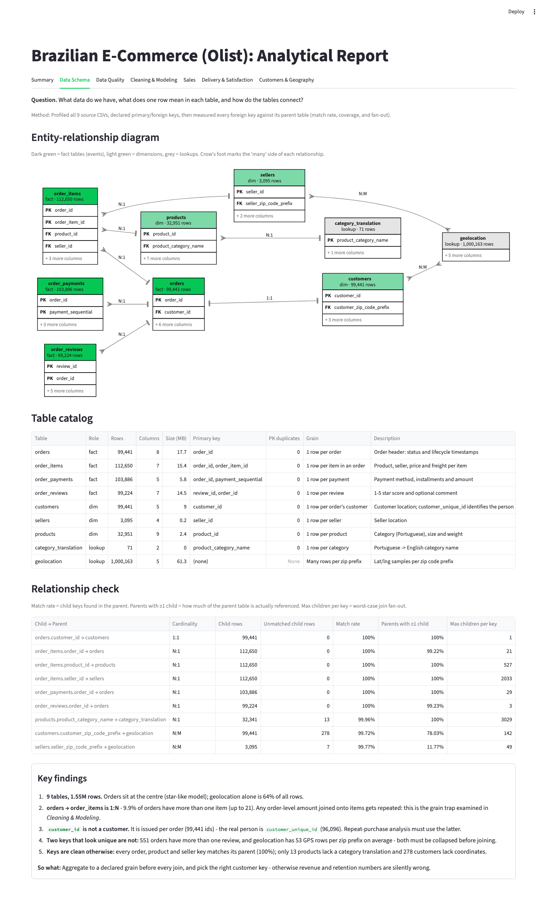
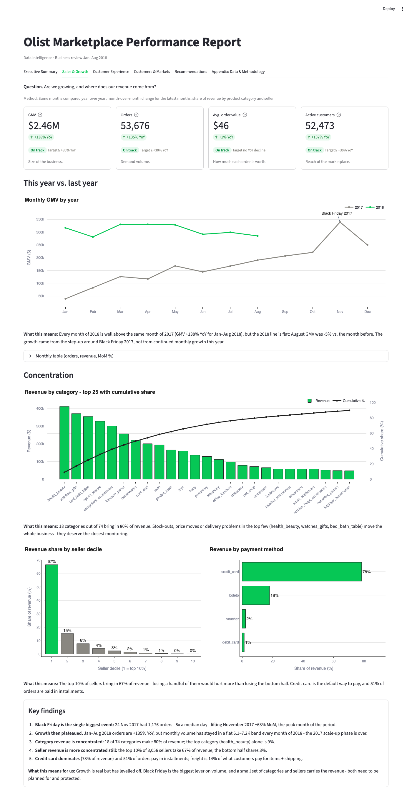
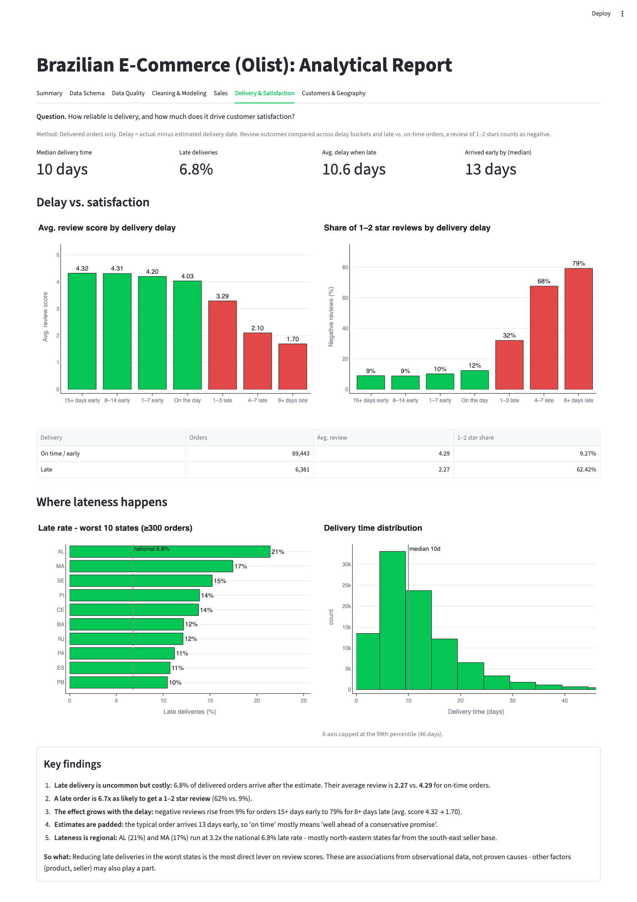

# Olist Brazilian E-Commerce Dashboard

[](https://brazilian-e-commerce-f4g54pnlecrcpe78uuhovp.streamlit.app/)


An analytical report in Streamlit on ~99K real orders from Olist, a Brazilian marketplace
(2016-2018). The tabs follow the analysis step by step (schema, data quality, cleaning &
modeling, sales, delivery & satisfaction, customers), and each tab ends with key findings
computed from the data.

## Preview

---

| Data Schema | Sales | Delivery & Satisfaction |
|:---:|:---:|:---:|
|  |  |  |

## Features

- Report tabs: Summary, Data Schema, Data Quality, Cleaning & Modeling, Sales, Delivery &
  Satisfaction, Customers & Geography. Each tab states its question and method, shows the
  evidence, and ends with key findings and a "so what"
- Data Schema: ER diagram, table catalog (grain, PK) and measured foreign-key match rates
- Data Quality: 17 automated checks (PASS/WARN/FAIL), monthly coverage and payment reconciliation
- Two fact tables with an explicit grain: order-level (1 row per order) and item-level
  (1 row per order item)
- Fixed USD display conversion and a shared Plotly chart-styling system for a consistent look
- Deployed on Streamlit Community Cloud

## Project Structure

```
Brazilian E-Commerce/
├── app.py                    # Entry point: builds the report tabs
├── src/
│   ├── data_loader.py        # Cached loaders for each CSV + order-level and item-level fact tables
│   ├── schema.py             # Table/key metadata, FK match rates, ER diagram (Graphviz DOT)
│   ├── quality.py            # Data quality checks, reconciliation, cleansing log
│   ├── metrics.py            # Shared metrics used by the tabs and the summary
│   ├── sections/             # One module per report tab
│   ├── currency.py           # Fixed BRL→USD display conversion
│   └── theme.py              # Brand color palette, Plotly styling, findings box
├── data/                     # Raw Olist CSVs
├── docs/                     # Reusable Streamlit theming notes
├── .streamlit/config.toml    # Theme
└── requirements.txt          # Python dependencies, version-pinned
```

## Dataset

Olist Store public e-commerce dataset. 9 CSV files (~99K orders, 1M+ geolocation records) joined
via `order_id`, `customer_id`, `product_id`, `seller_id`, and zip code prefix.

## Setup

```bash
python3 -m venv .venv
source .venv/bin/activate
pip install -r requirements.txt
streamlit run app.py
```

## Engineering Highlights

- Found that joining order-level payments onto order items inflated revenue by 28%. Rebuilt the
  model as two fact tables with an explicit grain, with an assertion that the order table
  cannot fan out.
- Reconciled payments against items + freight: totals differ by 0.02%, and only 0.25% of orders
  are off by more than R$1.
- Showed that late orders are 6.7x as likely to get a 1-2 star review (62% vs. 9%), and that
  negative reviews rise steadily with the size of the delay.
- Redesigned every chart against a systematic color methodology instead of default styling,
  catching a map silently centered on Africa and a Plotly title bug in the process.
- Migrated the UI from a multi-page app to a single-page tabbed layout and verified every release
  with headless-browser testing.
